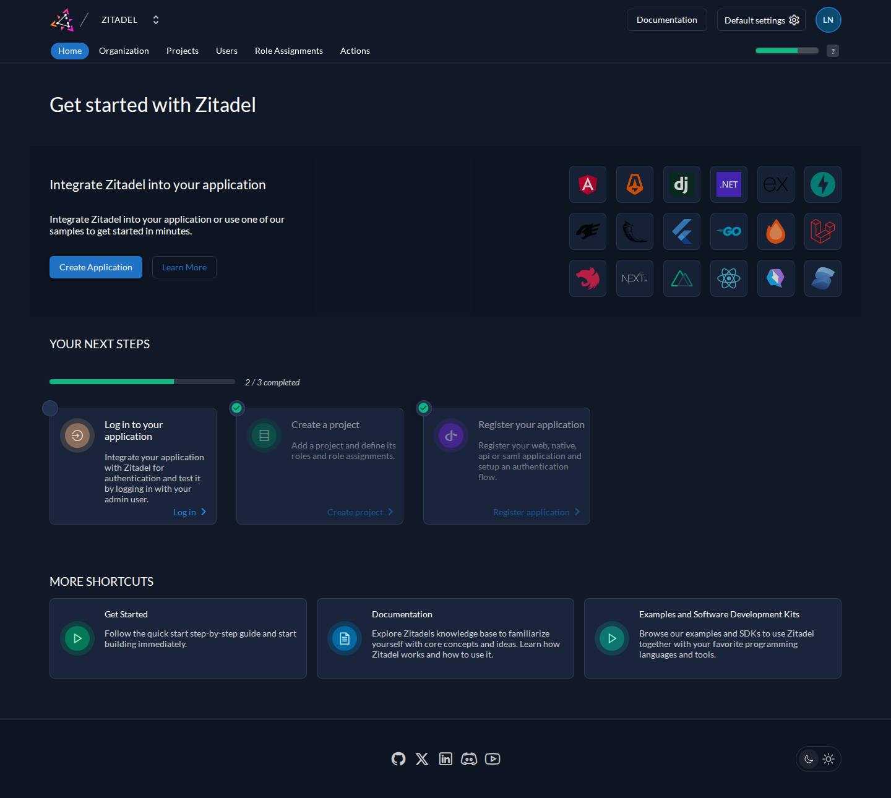
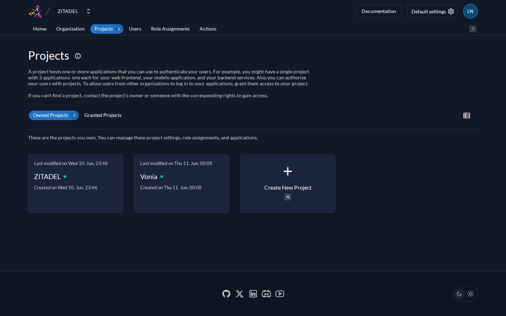
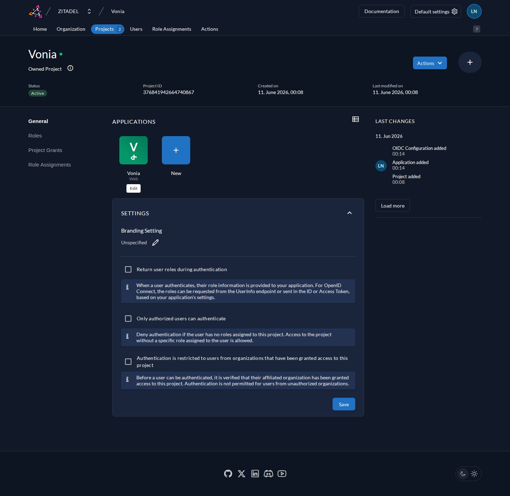
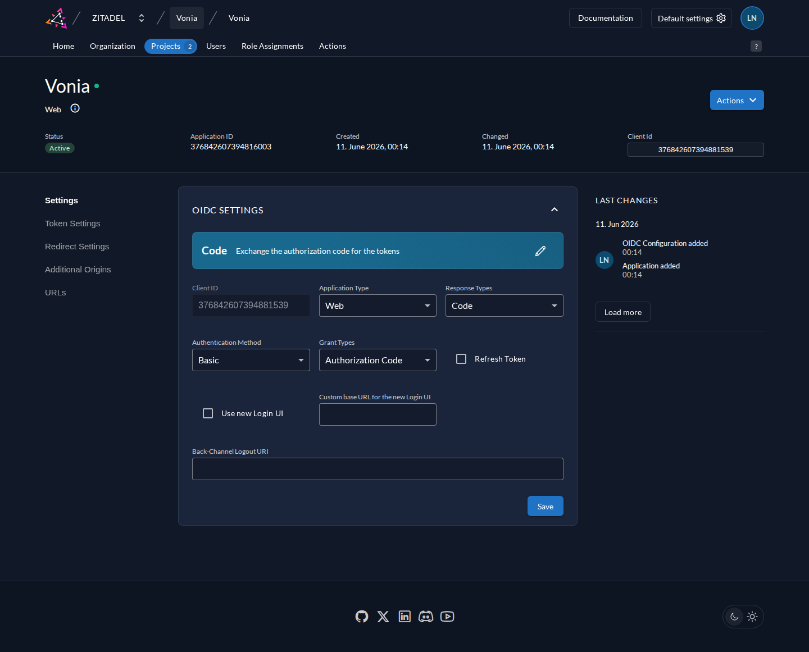
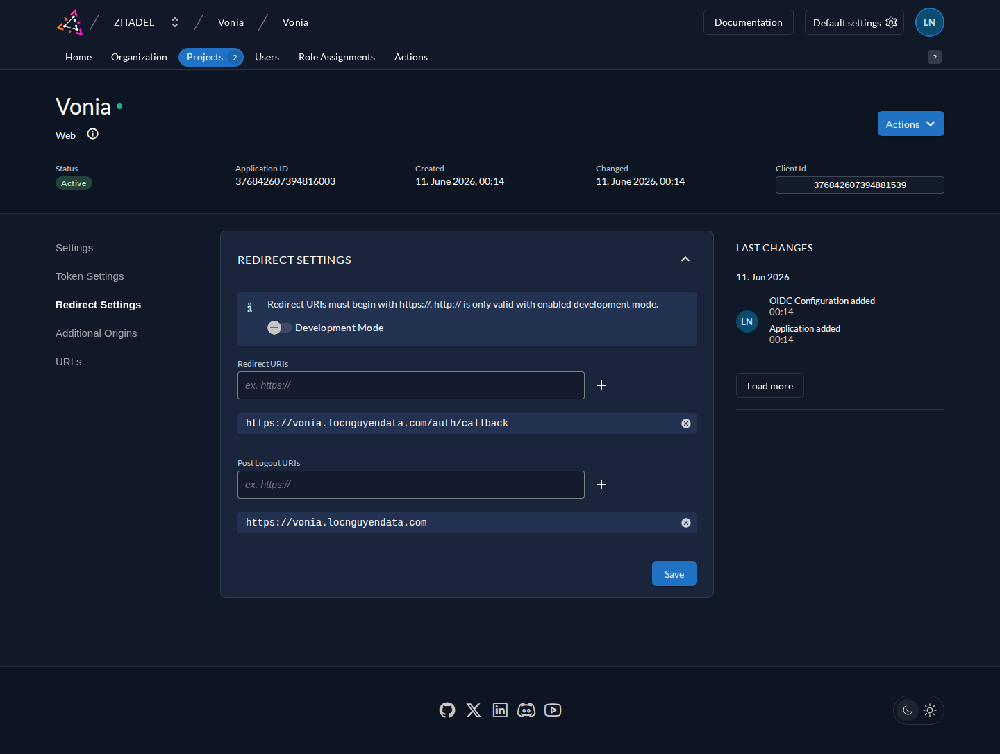
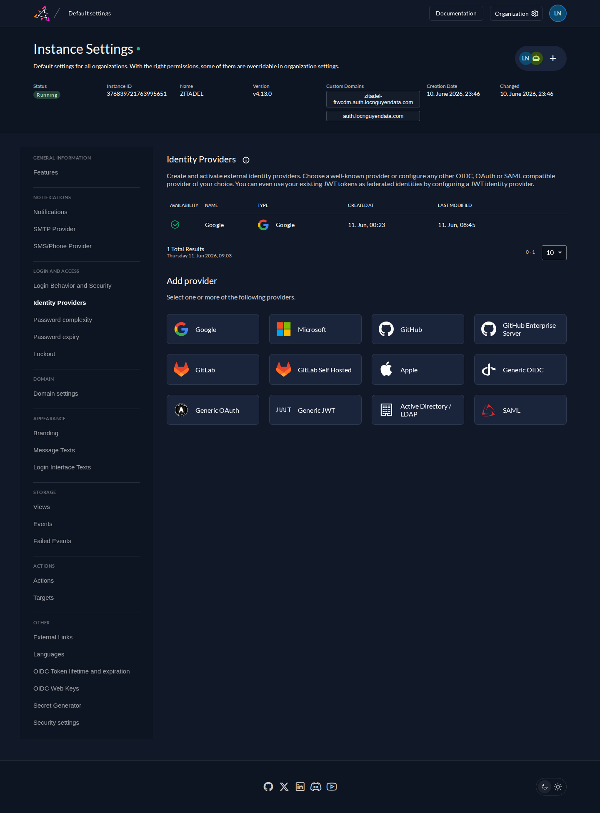
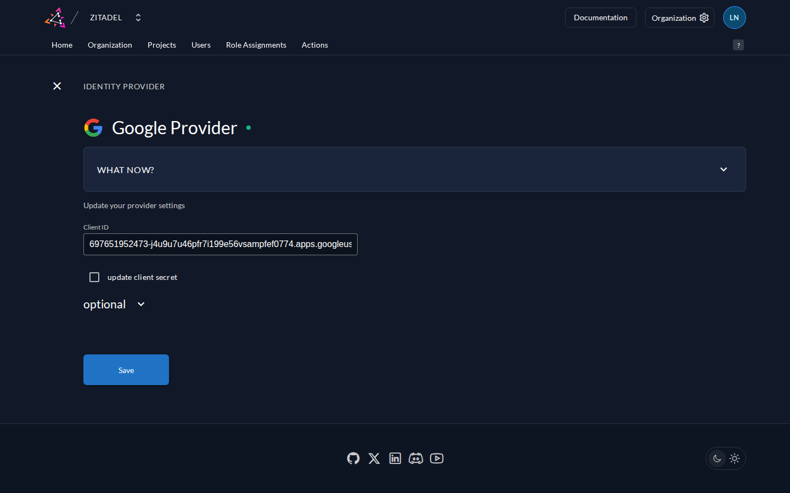
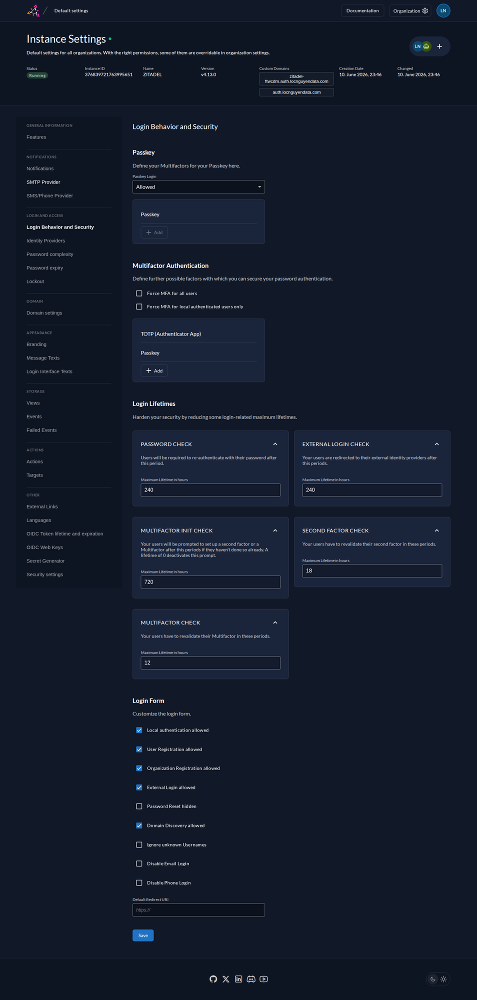
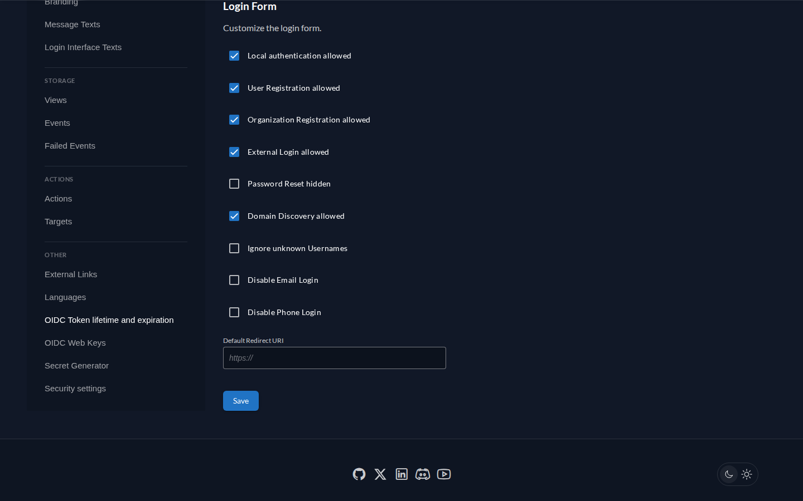
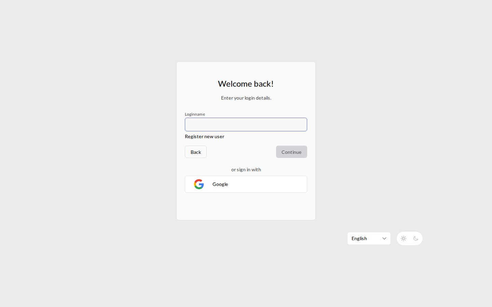

# Hướng dẫn cấu hình ZITADEL — auth.locnguyendata.com

> Tài liệu này ghi lại **toàn bộ cấu hình thực tế** của instance ZITADEL self-hosted tại
> `https://auth.locnguyendata.com`, kèm ảnh chụp màn hình thật từ console.
> Mục đích: làm OIDC provider cho **Vonia Voice Studio** (`vonia.locnguyendata.com`) với đăng nhập Google.
>
> Cập nhật: 11/06/2026 · ZITADEL v4.13.0

---

## Mục lục

1. [Kiến trúc & hạ tầng](#1-kiến-trúc--hạ-tầng)
2. [Đăng nhập console quản trị](#2-đăng-nhập-console-quản-trị)
3. [Tạo Project](#3-tạo-project)
4. [Tạo Application (OIDC Web · Code)](#4-tạo-application-oidc-web--code)
5. [Cấu hình Redirect URIs](#5-cấu-hình-redirect-uris)
6. [Lấy Client ID & Client Secret](#6-lấy-client-id--client-secret)
7. [Cấu hình Google Identity Provider](#7-cấu-hình-google-identity-provider)
8. [Bật External Login trong Login Policy](#8-bật-external-login-trong-login-policy)
9. [Kiểm tra kết quả](#9-kiểm-tra-kết-quả)
10. [Thông tin instance & vận hành](#10-thông-tin-instance--vận-hành)

---

## 1. Kiến trúc & hạ tầng

ZITADEL được cài bằng **Docker Compose chính thức** tại thư mục `/root/zitadel` trên server, gồm 4 container:

| Container | Vai trò | Ghi chú |
|---|---|---|
| `zitadel-proxy-1` | Traefik v3.6.8 — router nội bộ | Chỉ bind `127.0.0.1:8090`, không mở ra ngoài |
| `zitadel-zitadel-api-1` | ZITADEL API core (Go) | v4.13.0 |
| `zitadel-zitadel-login-1` | Login UI v2 (Next.js) | Phục vụ `/ui/v2/login` |
| `zitadel-postgres-1` | PostgreSQL 17.2 | Volume `zitadel_postgres-data` |

**Luồng truy cập:**

```
Internet → Cloudflare → cloudflared tunnel (trên server)
        → http://localhost:8090 (Traefik)
        → /ui/v2/login/* → container login UI
        → còn lại        → container API (gRPC h2c + HTTP)
```

- **Không mở port nào trên firewall** — cloudflared tạo kết nối outbound tới Cloudflare.
- Public hostname cấu hình trên **Cloudflare Zero Trust → Tunnels → Public Hostname**:
  `auth.locnguyendata.com` → `HTTP://localhost:8090`.
- Toàn bộ secrets (masterkey, mật khẩu Postgres) nằm trong `/root/zitadel/.env`.
  ⚠️ **Masterkey mã hóa dữ liệu — tuyệt đối không đổi sau khi đã khởi tạo. Hãy backup file `.env`.**

---

## 2. Đăng nhập console quản trị

- **URL console:** `https://auth.locnguyendata.com/ui/console`
- **Tài khoản admin:** `locphamnguyen@gmail.com` (đã đổi từ username mặc định
  `zitadel-admin@zitadel.auth.locnguyendata.com`; có passkey + password)

> 💡 Vào thẳng `/ui/console`. Nếu vào trang gốc `/` sau đăng nhập sẽ chỉ thấy trang
> "You are signed in" của Login UI — đó không phải lỗi.

Sau khi đăng nhập, console hiển thị trang Home:



Thanh điều hướng chính: **Home · Organization · Projects · Users · Role Assignments · Actions**.
Nút **Default settings** (góc phải trên) mở phần cấu hình toàn instance — nơi cấu hình IDP và Login Policy ở các bước sau.

---

## 3. Tạo Project

Project là "thùng chứa" các application và role. Mỗi sản phẩm nên có 1 project riêng.

**Đường dẫn:** Menu **Projects** → nút **+ Create New Project** → đặt tên `Vonia` → **Continue**.

Danh sách project sau khi tạo (project `ZITADEL` là project hệ thống có sẵn, không đụng vào):



Bấm vào project **Vonia** để mở trang quản lý. Trang project hiển thị khu **APPLICATIONS**, **SETTINGS**, lịch sử thay đổi, và menu trái (General · Roles · Project Grants · Role Assignments):



> Các checkbox trong SETTINGS (Return user roles, Only authorized users can authenticate…)
> để **mặc định không tick** — Vonia kiểm soát quyền bằng email allowlist ở phía app rồi.

---

## 4. Tạo Application (OIDC Web · Code)

**Đường dẫn:** trong project Vonia → khu APPLICATIONS → ô **+ New**.

Wizard 4 bước:

| Bước | Lựa chọn | Lý do |
|---|---|---|
| 1. Name and Type | Name: `Vonia` · Type: **Web** | Backend FastAPI render web, giữ được secret |
| 2. Authentication Method | **CODE** | Authorization Code + client secret (confidential client). KHÔNG chọn PKCE — PKCE là public client, không cấp secret |
| 3. Redirect URIs | điền như mục 5 | |
| 4. Overview | Review → **Create** | Client ID + Secret hiện ra ngay sau khi tạo |

Kết quả — trang **OIDC SETTINGS** của app sau khi tạo:



Các giá trị chuẩn cần khớp:

- **Application Type:** `Web`
- **Response Types:** `Code`
- **Authentication Method:** `Basic` (client_id + secret gửi qua HTTP Basic khi đổi code lấy token)
- **Grant Types:** `Authorization Code`
- **Refresh Token:** chưa bật (bật nếu muốn session app sống lâu mà không re-auth — cần thêm scope `offline_access`)

---

## 5. Cấu hình Redirect URIs

**Đường dẫn:** trang app Vonia → menu trái **Redirect Settings**.



Giá trị đã cấu hình:

| Trường | Giá trị |
|---|---|
| Redirect URIs | `https://vonia.locnguyendata.com/auth/callback` |
| Post Logout URIs | `https://vonia.locnguyendata.com` |
| Development Mode | **Tắt** (chỉ bật nếu cần test với `http://localhost`) |

⚠️ URI phải khớp **chính xác từng ký tự** với `redirect_uri` mà backend gửi lên —
không thêm `/` cuối, không query string. Sai sẽ gặp lỗi `redirect_uri_mismatch`.

---

## 6. Lấy Client ID & Client Secret

- **Client ID** hiển thị ngay đầu trang app (xem ảnh mục 4): `376842607394881539`
- **Client Secret** chỉ hiện **một lần duy nhất** lúc tạo app. Nếu mất:
  trang app → nút **Actions** (góc phải trên) → **Regenerate Client Secret** → copy ngay.

Điền vào `.env` của Vonia:

```bash
ZITADEL_DOMAIN=auth.locnguyendata.com
ZITADEL_CLIENT_ID=376842607394881539
ZITADEL_CLIENT_SECRET=<secret đã copy>
```

> Regenerate secret sẽ vô hiệu secret cũ ngay lập tức — nhớ restart app sau khi cập nhật `.env`.

---

## 7. Cấu hình Google Identity Provider

### 7a. Tạo OAuth credentials phía Google

1. Vào [console.cloud.google.com](https://console.cloud.google.com) → **APIs & Services → Credentials**
2. **Create Credentials → OAuth 2.0 Client ID** → Application type: **Web application**
3. **Authorized redirect URIs** thêm:
   ```
   https://auth.locnguyendata.com/idps/callback
   ```
4. Create → copy **Client ID** và **Client Secret** của Google

### 7b. Khai báo provider trong ZITADEL

**Đường dẫn:** **Default settings** (góc phải trên) → menu trái **Identity Providers**.

Danh sách provider khả dụng (Google, Microsoft, GitHub, GitLab, Apple, SAML…). Provider **Google** đã được tạo và đang **Active** (dòng đầu bảng):



Bấm **Google** trong "Add provider" (lần đầu) hoặc bấm dòng Google trong bảng (chỉnh sửa). Form cấu hình:



| Trường | Giá trị |
|---|---|
| Name | `Google` (hiện trên nút đăng nhập) |
| Client ID | Client ID lấy từ Google Cloud (đuôi `.apps.googleusercontent.com`) |
| Client Secret | Secret từ Google Cloud |
| Scopes | mặc định `openid profile email` |

Phần **optional** (các tùy chọn hành vi):

| Tùy chọn | Giá trị khuyến nghị | Ý nghĩa |
|---|---|---|
| Automatic creation | ✅ | User Google đăng nhập lần đầu được tự tạo tài khoản |
| Automatic update | ✅ | Tự cập nhật tên/email khi đăng nhập lại |
| Account creation allowed (manually) | ✅ | Cho phép tạo tài khoản từ external IDP |
| Account linking allowed (manually) | ✅ | Cho phép link thủ công |
| Prompt link to existing account | **Check for existing Email** | Trùng email → đề nghị liên kết thay vì tạo user trùng lặp (email Google luôn đã verify nên an toàn) |

### 7c. Kích hoạt provider

Sau khi Save, provider ở trạng thái **Inactive**. Trong danh sách Identity Providers,
bấm nút **Activate** (menu ⋮ trên dòng provider). Cột AVAILABILITY phải hiện dấu ✓ xanh như ảnh mục 7b.

> Lưu ý: IDP **không gắn theo từng application**. Provider active ở cấp instance/org
> sẽ tự động hiện trên trang đăng nhập của **mọi** app trong org.

---

## 8. Bật External Login trong Login Policy

Provider active thôi chưa đủ — Login Policy phải cho phép đăng nhập bằng IDP ngoài.

**Đường dẫn:** **Default settings → Login Behavior and Security**.



Kéo xuống phần **Login Form**, đảm bảo tick **External Login allowed**:



Trạng thái hiện tại của instance:

- ✅ Local authentication allowed (vẫn cho đăng nhập username/password)
- ✅ User Registration allowed
- ✅ **External Login allowed** ← bắt buộc cho Google IDP
- ✅ Domain Discovery allowed
- Passkey Login: **Allowed**

> 💡 Nếu sau này muốn **chỉ cho đăng nhập Google** (ẩn form password):
> bỏ tick "Local authentication allowed". Cẩn thận: admin cũng sẽ phải đăng nhập qua Google/passkey.

---

## 9. Kiểm tra kết quả

Mở cửa sổ ẩn danh, vào `https://auth.locnguyendata.com` — trang đăng nhập phải có nút **Google**:



Kiểm tra luồng đầy đủ với app Vonia:

```
1. Vào https://vonia.locnguyendata.com/auth/login
2. → redirect sang https://auth.locnguyendata.com/oauth/v2/authorize?...
3. → bấm nút Google → đăng nhập Google
4. → ZITADEL redirect về https://vonia.locnguyendata.com/auth/callback?code=...
5. → backend đổi code lấy token, check email allowlist → vào app
```

Kiểm tra OIDC discovery (phải trả về issuer đúng):

```bash
curl -s https://auth.locnguyendata.com/.well-known/openid-configuration | python3 -m json.tool | head
# "issuer": "https://auth.locnguyendata.com"
```

**Lỗi thường gặp:**

| Lỗi | Nguyên nhân | Cách sửa |
|---|---|---|
| `redirect_uri_mismatch` | URI không khớp | Xem lại mục 5 — khớp từng ký tự |
| `client_id not found` | Sai Client ID | Xem lại mục 6 |
| `unauthorized_client` | App không phải Web/CODE | Tạo lại app theo mục 4 |
| Không thấy nút Google | Provider chưa Activate hoặc External Login chưa bật | Mục 7c và mục 8 |
| Google báo `redirect_uri_mismatch` | Thiếu URI callback phía Google Cloud | Mục 7a — `https://auth.locnguyendata.com/idps/callback` |

---

## 10. Thông tin instance & vận hành

### Định danh quan trọng

| Mục | Giá trị |
|---|---|
| Issuer / Domain | `https://auth.locnguyendata.com` |
| Console | `https://auth.locnguyendata.com/ui/console` |
| Project Vonia | ID `376841942664740867` |
| App Vonia (Web/OIDC) | ID `376842607394816003` |
| Client ID | `376842607394881539` |
| Redirect URI | `https://vonia.locnguyendata.com/auth/callback` |
| Post-logout URI | `https://vonia.locnguyendata.com` |
| Org mặc định | ID `376839721764061187` (domain `zitadel.auth.locnguyendata.com`) |
| ZITADEL version | v4.13.0 (pin trong `/root/zitadel/.env` → `ZITADEL_VERSION`) |

### Lệnh vận hành (chạy trong `/root/zitadel`)

```bash
docker compose ps                        # trạng thái 4 container
docker compose logs -f zitadel-api      # log API
docker compose restart                   # khởi động lại stack
docker compose down && docker compose up -d --wait   # stop/start (KHÔNG dùng -v: -v xóa sạch dữ liệu!)

# Nâng cấp phiên bản: sửa ZITADEL_VERSION trong .env rồi
docker compose pull && docker compose up -d --wait

# Backup database
docker compose exec -T postgres pg_dump -U postgres zitadel | gzip > zitadel-backup-$(date +%F).sql.gz
```

### Checklist an toàn

- [x] Masterkey + mật khẩu Postgres ngẫu nhiên trong `/root/zitadel/.env` — **backup file này**
- [x] Traefik chỉ bind `127.0.0.1:8090`, không expose port ra Internet
- [x] Admin đã đổi mật khẩu mặc định + đăng ký passkey
- [ ] Cân nhắc backup `pg_dump` định kỳ (cron)
- [ ] Cân nhắc cấu hình SMTP (Default settings → SMTP Provider) để gửi email verify/reset password
